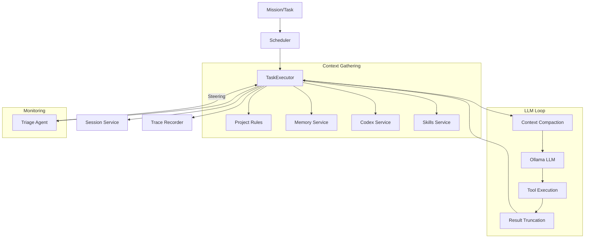

# Audit: Current Context and Task Execution Flow

This document maps how context is captured, managed, and passed during task execution in Vibes.

## 1. Flow Overview

The execution flow starts at the `Scheduler` and descends into the `TaskExecutor`.

### Phase A: Mission Initiation
1.  **Entry Point:** `Scheduler.run()` iterates through milestones and tasks.
2.  **Task Trigger:** `Scheduler.executeTask(task)` is called for ready tasks.

### Phase B: Context Gathering (`TaskExecutor.executeTask`)
Before the LLM loop starts, `TaskExecutor` gathers environmental context:
- **Project Rules:** Discovers and reads `AGENTS.md`, `GEMINI.md`, `.cursorrules`, etc.
- **Skills:** Formats available agent skills.
- **Codex:** Retrieves tech-stack specific patterns from Neo4j (if enabled).
- **Memory:** Retrieves relevant historical memories for the current task title/description.
- **Tech Stack:** Detects or uses provided tech stack.
- **System Prompt:** Combines all the above into a static system message.

### Phase C: The Agent Loop (LLM Interaction)
The main loop in `TaskExecutor` manages the conversation state (`messages` array).

1.  **Context Pre-processing:**
    - **Hard Cap:** If messages exceed 150, `compressMessages` is forced.
    - **Compaction:** `hooks.transformContext` (calling `compact`) is invoked to keep messages within the token budget.
    - **Summarization Strategy:** Currently uses a **Head (2) + Summary (middle) + Tail (6)** approach.
2.  **Steering Injection:**
    - Triage guidance or user guidance is injected as a new user message before the LLM call.
3.  **LLM Call:**
    - Invokes the model (Ollama) with current messages and tools.
4.  - **Reasoning Extraction:**
    - Thinking blocks (`<think>`) and `reasoning_content` are extracted and emitted.
    - **Cleanup:** `<think>` blocks are stripped from the message content before persistence to save tokens and prevent "reasoning leakage" into subsequent turns.
5.  **Tool Execution:**
    - Parses tool calls (with `repairJson` fallback).
    - Runs `beforeToolCall` hooks.
    - Executes tools (Parallel or Sequential).
    - Runs `afterToolCall` hooks.
    - **Truncation:** Tool results exceeding 6k tokens (or 25% budget) are truncated via `truncateToolResult`.
6.  **Loop Control:**
    - `shouldStopAfterTurn` (via `AgentLoopHooks`) checks for thrashing (identical failing sequences).
    - Loop repeats until a text response is received or max steps are hit.

## 2. Context Management Components

| Component | Responsibility |
| :--- | :--- |
| `TaskExecutor` | Manages the `messages` array, system prompt construction, and the main loop. |
| `ContextManager` | Provides token estimation (`gpt-tokenizer`), truncation, and the `compressMessages` summarizer. |
| `TriageAgent` | Monitors for thrashing, loops, and context pressure; injects steering messages mid-task. |
| `Scheduler` | Manages mission-level state, retries, reviewer feedback, and user interventions. |
| `SessionService` | Persists the full mission/task state and event history to `.vibes/sessions/`. |
| `Trace` | Low-level append-only JSONL event logging in `.vibes/traces/`. |

## 3. Data Flow Diagram (Conceptual)

## 4. Current Limitations & Observations

- **Compaction is Lossy:** The current Head+Tail summary drops intermediate tool outputs entirely once triggered.
- **State Persistence:** Session data is saved as a single large JSON per mission. Long missions may result in very large session files.
- **Reconstruction:** Currently, there is no explicit "checkpoint and rehydrate" mechanism; if a session is lost or context window is hit, the agent relies on the lossy summary.
- **Token Estimation:** Uses `gpt-tokenizer`, which is an approximation for non-GPT models (like Llama/Gemma).
